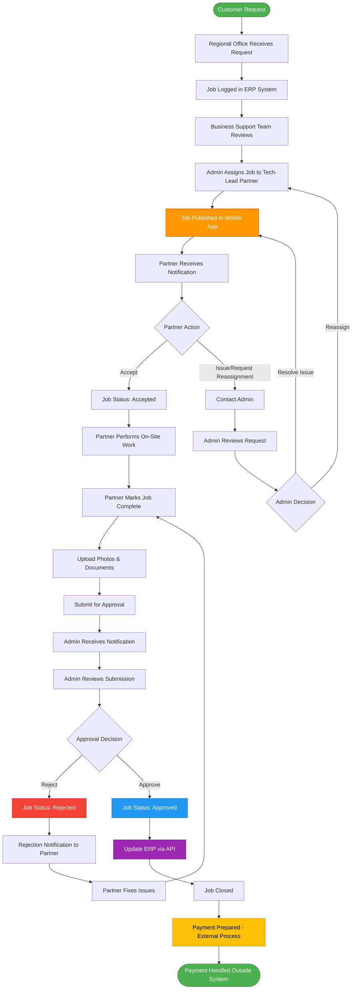
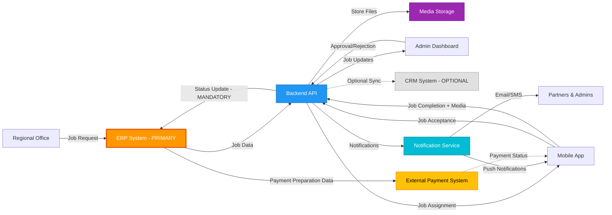
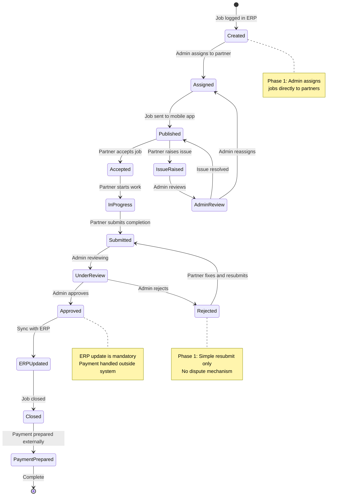

# ✅ CORRECTED System Flowcharts - Phase 1 Scope

> **IMPORTANT:** This version has been corrected to accurately reflect Phase 1 charter requirements.

## 🔧 Corrections Made

### ❌ Issues Fixed:
1. **Payment Processing** → Changed to **Payment Preparation (External)**
2. **Auto-Decline/Reassign** → Changed to **Manual Admin Review**
3. **Dispute Flow** → Removed (not in Phase 1 scope)
4. **CRM Integration** → Downgraded to **Optional/Secondary** (ERP is primary)

---

## Complete System Flow Diagram - CORRECTED

### Key Changes:
- ✅ Admin directly assigns jobs (no broadcast/decline)
- ✅ Partner can raise issues → Admin manually reviews
- ✅ Payment shown as external process
- ✅ Removed dispute flow

---

## Tech-Lead Partner Mobile App Flow - CORRECTED

```mermaid
graph LR
    A([Launch App]) --> B{Logged In?}
    B -->|No| C[Login Screen]
    B -->|Yes| D[Job Card Dashboard]
    
    C --> E[Enter Credentials]
    E --> F{Valid?}
    F -->|No| C
    F -->|Yes| D
    
    D --> G[View Assigned Jobs]
    G --> H{Select Job}
    H --> I[View Job Details]
    
    I --> J{Action}
    J -->|Accept| K[Job Status: Accepted]
    J -->|Issue| L[Contact Admin]
    J -->|Back| G
    
    K --> M[Start Job]
    M --> N[Complete Work]
    N --> O[Upload Photos]
    O --> P[Upload Documents]
    P --> Q[Submit for Approval]
    
    Q --> R[Wait for Admin Review]
    R --> S{Result}
    S -->|Approved| T[Job Approved - Payment Pending]
    S -->|Rejected| U[View Rejection Reason]
    
    U --> V[Fix Issues]
    V --> O
    
    T --> W[View in Earnings Summary]
    
    style A fill:#4CAF50,stroke:#2E7D32,color:#fff
    style D fill:#2196F3,stroke:#1565C0,color:#fff
    style T fill:#4CAF50,stroke:#2E7D32,color:#fff
    style U fill:#F44336,stroke:#C62828,color:#fff
```

### Key Changes:
- ✅ "Available Jobs" → "Assigned Jobs" (admin assigns)
- ✅ Removed "Dispute" option
- ✅ "Earnings Updated" → "Payment Pending" (external process)

---

## Data Flow Diagram - CORRECTED

### Key Changes:
- ✅ ERP marked as PRIMARY (bold border)
- ✅ CRM marked as OPTIONAL (dotted line, gray)
- ✅ Payment system shown as EXTERNAL
- ✅ Mandatory vs optional integrations clearly marked

---

## Job Lifecycle State Machine - CORRECTED

### Key Changes:
- ✅ Removed "Reassigned" auto-decline state
- ✅ Added "IssueRaised" → "AdminReview" manual flow
- ✅ Removed "Disputed" state
- ✅ Separated "Closed" and "PaymentPrepared" states
- ✅ Added clarifying notes for Phase 1 scope

---

## Summary of Phase 1 Scope

### ✅ What IS in Phase 1:
- Admin assigns jobs directly to partners
- Partner accepts or raises issues (manual admin review)
- Job completion with photo/document upload
- Admin approval/rejection workflow
- Simple resubmit on rejection
- ERP integration (mandatory)
- Job closure in system
- Payment preparation data sent to external system

### ❌ What is NOT in Phase 1:
- Auto-decline/reassignment
- Dispute mechanism
- Automated payment processing
- CRM mandatory integration
- Broadcast job assignments
- Partner-initiated job selection

---

## Integration Priorities

### 🔴 Mandatory (Phase 1):
- **ERP System** - Job creation, status updates, payment preparation data
- **Backend API** - Core system functionality
- **Media Storage** - Photo and document uploads
- **Notification Service** - Real-time updates

### 🟡 Optional (Phase 1):
- **CRM System** - Read-only or selective sync
- **SMS Gateway** - If email/push notifications insufficient

### 🔵 Future (Phase 2+):
- Location-based assignment
- Live tracking
- Automated dispute resolution
- Advanced analytics

---

> **✅ VERIFIED:** These flowcharts now accurately reflect the Phase 1 charter requirements and are suitable for management review and technical implementation.
